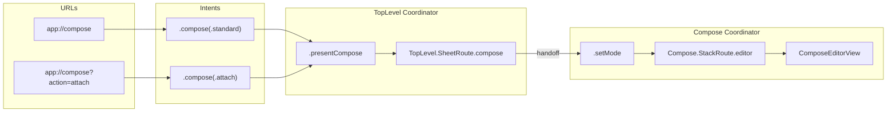

# Iris Visualize

Generates a Mermaid flowchart of the complete link routing tree in an iOS project using Iris. Shows how URLs flow through intents, navigation steps, routes, and finally to destination views.

## Prerequisites

- An existing iOS project with Iris integrated
- Navigation files following the Iris conventions (intent enums, route enums, codec, coordinator, navigation steps)

---

## Phase 0: Version Check

Same as `iris-bootstrap`:

1. Locate Iris dependency (local path from `Package.swift` or resolved version from `Package.resolved`)
2. Read the version tag
3. If version < `1.0.0` or unrecognised, warn and ask whether to proceed

---

## Phase 1: Discover the Routing Tree

Search the project for all navigation files and build a structured model of the routing tree.

### Discovery steps

1. **Find all files importing Iris:**
   ```
   grep -rl "import Iris" --include="*.swift" .
   ```

2. **Find intent enums**: look for enums conforming to `Sendable, Equatable` that contain a `case unknown(URL)`:
   ```
   grep -l "case unknown(URL)" --include="*.swift" .
   ```
   Read each file to extract the intent enum name and all its cases (including nested intent enums like `ComposeIntent`).

3. **Find route enums**: look for namespace enums containing `StackRoute` and/or `SheetRoute`:
   ```
   grep -l "enum StackRoute" --include="*.swift" .
   ```
   Read each file to extract route namespace names (e.g. `TopLevel`, `Compose`) and all route cases.

4. **Find navigation flow enums**: look for `NavigationFlow` conformance:
   ```
   grep -l "NavigationFlow" --include="*.swift" .
   ```
   Read each file to extract the flow's `Route`, `SheetRoute`, and `SideEffect` types and the `operations(intent:)` switch body. Each arm returns `[Step<Route, SheetRoute, SideEffect>]`, where `Step.nav(_)` is a structural target the library dispatches and `Step.effect(_)` is a consumer side-effect.

5. **Find URL codec**: look for `URLParsing` conformance:
   ```
   grep -l "URLParsing" --include="*.swift" .
   ```
   Read the file to extract `parse(_:)` switch cases. Map each URL pattern to the intent it returns.

6. **Find coordinators**: look for `RouteCoordinator` conformance:
   ```
   grep -l "RouteCoordinator" --include="*.swift" .
   ```
   Read each file to extract `apply(_:_:)` switch cases. Map each step to the route it navigates to.

7. **Find view destinations**: look for `.navigationDestination(for:` and `.sheet(item:`:
   ```
   grep -rn "\.navigationDestination(for:" --include="*.swift" .
   grep -rn "\.sheet(item:" --include="*.swift" .
   ```
   Read surrounding code to extract the switch cases and the view each route renders.

### Build the routing model

For each intent case, trace the full chain:

| Layer | Source | How to trace |
|-------|--------|--------------|
| URL → Intent | Codec `parse(_:)` | Each switch arm returns an intent for a URL pattern |
| Intent → Steps | `NavigationFlow.operations(intent:)` | Each intent case returns an array of `Step` values |
| Step → Route | `Step.nav(.push/.present)` (library-dispatched) or coordinator `apply(_:_:)` for `Step.effect(_)` | Structural cases route automatically; effect cases are consumer-handled |
| Route → View | `.navigationDestination` / `.sheet` | Each route case renders a specific view |

Store the complete chain for every intent before proceeding to diagram generation.

---

## Phase 2: Generate Mermaid Diagram

Produce a Mermaid `flowchart LR` diagram with subgraphs for each layer.

### Diagram structure

```
flowchart LR
    subgraph URLs
        ...
    end
    subgraph Intents
        ...
    end
    subgraph Steps
        ...
    end
    subgraph Routes
        ...
    end
    subgraph Views
        ...
    end
    %% edges
```

### Node naming conventions

| Layer | Node ID prefix | Label format | Example |
|-------|---------------|--------------|---------|
| URLs | `U` | `"scheme://host/path?query"` | `U1["app://inbox"]` |
| Intents | `I` | `".caseName(params)"` | `I2[".showBadge(name:)"]` |
| Steps | `S` | `".caseName"` | `S1[".pushInbox"]` |
| Routes | `R` | `"Namespace.RouteType.case"` | `R1["TopLevel.StackRoute.inbox"]` |
| Views | `V` | `"ViewName"` | `V1["InboxView"]` |

### Generation rules

1. **URLs subgraph:** One node per distinct URL pattern found in the codec's `parse(_:)`. Represent path parameters with placeholders (e.g. `{uuid}`). Represent query parameters with `?key=...`.

2. **Intents subgraph:** One node per intent case (excluding `.unknown`). For intents with nested sub-intents (e.g. `.compose(.standard)`, `.compose(.attach)`), create a separate node per sub-case.

3. **Steps subgraph:** One node per unique navigation step case. If `.popToRoot` appears in multiple intent flows, include it once. Show it connected from all intents that use it.

4. **Routes subgraph:** One node per route case across all route namespaces. Prefix with namespace (e.g. `TopLevel.StackRoute.inbox`).

5. **Views subgraph:** One node per destination view. Use the actual view struct name found in the `.navigationDestination` or `.sheet` switch body.

6. **Edges:** Draw edges following the traced chain:
   - `U --> I` (URL to intent, from codec parse)
   - `I --> S` (intent to steps, from operations). If an intent produces multiple steps, use `&` syntax: `I1 --> S0 & S1`
   - `S --> R` (step to route, from coordinator apply)
   - `R --> V` (route to view, from navigation destination)

### Handling multiple coordinators

If the project has multiple coordinators (e.g. `TopLevelRouteCoordinator` and `ComposeRouteCoordinator`):

- Generate a **separate subgraph per coordinator** wrapping the Steps, Routes, and Views layers for that coordinator's scope.
- Label each coordinator subgraph: `subgraph TopLevelCoordinator["TopLevel Coordinator"]`
- Show the handoff edge from the parent coordinator's sheet/push to the child coordinator's entry point.

Example with nested coordinator:



### Handling shared steps

The `.popToRoot` step is typically shared across multiple intents. Represent it once in the Steps subgraph and draw edges from all intents that use it. Do not draw an edge from `.popToRoot` to a route: it does not produce a route; it clears the stack.

---

## Phase 3: Output

### 1. Print the diagram

Output the complete Mermaid diagram as a fenced code block:

````markdown

````

### 2. Write to file

Ask the user for their preferred output location. Default: `<ProjectRoot>/link-routing.md`.

Write the file with a title and the fenced Mermaid block:

```markdown
# Link Routing Tree

Generated by `iris-visualize` on YYYY-MM-DD.


```

### 3. Summary table

After the diagram, print a summary table listing every traced chain:

```markdown
| URL | Intent | Steps | Route | View |
|-----|--------|-------|-------|------|
| `app://inbox` | `.showInbox` | `popToRoot, pushInbox` | `TopLevel.StackRoute.inbox` | `InboxView` |
| `app://ui/badge?name=...` | `.showBadge(name:)` | `popToRoot, pushBadges` | `TopLevel.StackRoute.badges` | `BadgesView` |
```

---

## Edge Cases

### No codec found

If no `URLParsing` conformance is found:
- Skip the URLs subgraph entirely.
- Generate the diagram starting from Intents: `Intent → Steps → Routes → Views`.
- Note in the output: "No URL codec found; URL layer omitted."

### Uncovered routes

If any route cases exist that are not reachable through the intent → step → apply chain:
- Add a separate subgraph with dashed-border styling:

```mermaid
subgraph Uncovered["Uncovered Routes"]
    style Uncovered stroke-dasharray: 5 5
    X1["TopLevel.StackRoute.settings"]
    X2["TopLevel.StackRoute.profile"]
end
```

- List these in the summary with a note: "Not reachable via links."

### No Iris integration found

If no files import Iris, report: "No Iris integration detected. Run `iris-bootstrap` first."

### Multiple navigation stacks

Some projects have nested `NavigationStack` instances inside sheets. The discovery in Phase 1 step 7 should find all `.navigationDestination(for:)` registrations regardless of nesting depth. Each gets its own Routes → Views mapping.

### Intent cases with no URL mapping

If an intent case exists but has no corresponding URL parse entry in the codec:
- Include it in the Intents subgraph.
- Do not draw a `U --> I` edge for it.
- Add a note: `I_N:::noUrl` with style `classDef noUrl stroke-dasharray: 3 3`.
- List it in the summary table with the URL column showing "—".

### Ambiguous view names

If the view rendered in a `.navigationDestination` or `.sheet` switch arm is not a simple struct name (e.g. it is an inline `VStack` or a computed view), use a descriptive label like `"[inline view]"` and note the file and line number.

### Partial integration

If some layers are missing (e.g. intent enum exists but no navigation steps), generate the diagram for the layers that exist and note which layers are missing. Do not fail silently.
